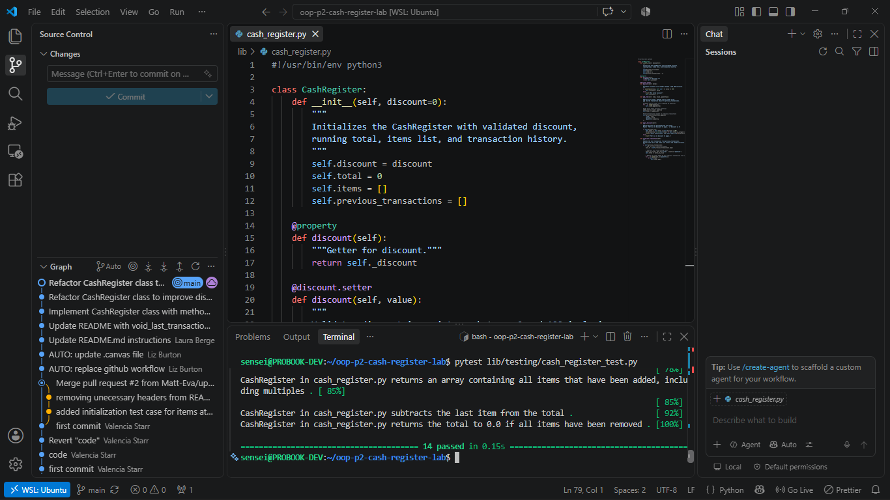

# Cash Register OOP Implementation

## Overview
This repository contains an Object-Oriented Programming (OOP) implementation of a `CashRegister` class built with Python. The application handles item additions, itemized transaction history, percentage-based discounts with built-in validation, and the ability to void recent transactions.

---

## Features

* **Dynamic Item Management**: Add individual items or multiple quantities at once while maintaining an accurate running total and item list.
* **Discount Validation & Application**: 
  * Implements `@property` getters and setters for the `discount` attribute.
  * Validates that discounts are integers between `0` and `100` inclusive, defaulting to `0` and logging `"Not valid discount"` if invalid inputs are provided.
  * Correctly calculates percentage discounts off the subtotal.
* **Transaction History & Voiding**: 
  * Logs each addition as a transaction object in `previous_transactions`.
  * The `void_last_transaction()` method rolls back the item history, subtracts the precise cost, and updates the register's total seamlessly.

---

## Test Results


---

## File Structure

```text
.
├── lib/
│   ├── cash_register.py         # Main CashRegister class implementation
│   └── testing/
│       └── cash_register_test.py # Unit test suite
├── README.md                     # Project documentation
└── pytest_results.png            # Test execution evidence


